# AWS IAM Cross-Account Access

Terraform-deployed cross-account IAM role allowing a SecurityAccount to assume a read-only audit role in a WorkloadAccount. Trust policy enforces ExternalId (confused deputy mitigation) and MFA as conditions.

---

## Architecture

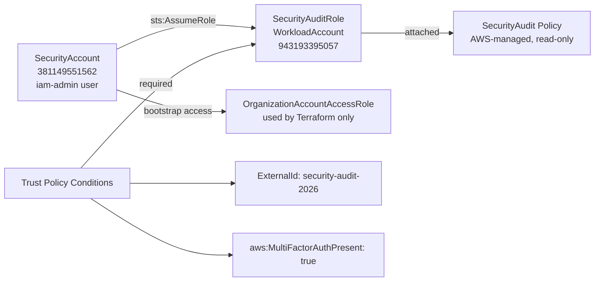

---

## Overview

This project sets up cross-account role assumption between two AWS accounts in an Organization — a common pattern in enterprise AWS environments where a central security account needs read-only access to workload accounts for auditing.

The SecurityAccount (management) assumes a role in the WorkloadAccount (member). The role has two conditions on the trust policy: an ExternalId to prevent confused deputy attacks, and an MFA requirement so only an authenticated human can assume it. The attached policy is AWS-managed SecurityAudit — read-only access to list and describe resources, no write permissions.

Everything is deployed with Terraform.

---

## AWS account setup

| Account | ID | Role |
|---|---|---|
| SecurityAccount | 381149551562 | Management account, where `iam-admin` user lives |
| WorkloadAccount | 943193395057 | Member account, where `SecurityAuditRole` is created |

Terraform accesses the WorkloadAccount by assuming `OrganizationAccountAccessRole` — a role AWS Organizations creates automatically in member accounts, trusted by the management account. This is the bootstrap mechanism.

---

## Terraform files

```
terraform/
├── main.tf        # Provider config — two AWS providers (security + workload aliases)
├── iam_role.tf    # SecurityAuditRole with trust policy conditions
└── outputs.tf     # Role ARN and ExternalId outputs
```

### Provider configuration (`main.tf`)

Two providers, both in us-east-1. The `workload` provider assumes `OrganizationAccountAccessRole` to deploy resources in the WorkloadAccount:

```hcl
provider "aws" {
  region = "us-east-1"
  alias  = "security"
}

provider "aws" {
  region = "us-east-1"
  alias  = "workload"

  assume_role {
    role_arn = "arn:aws:iam::943193395057:role/OrganizationAccountAccessRole"
  }
}
```

### IAM role with trust policy (`iam_role.tf`)

The trust policy on `SecurityAuditRole` has two conditions that must both be true for `sts:AssumeRole` to succeed:

```hcl
resource "aws_iam_role" "security_audit_role" {
  provider = aws.workload
  name     = "SecurityAuditRole"

  assume_role_policy = jsonencode({
    Version = "2012-10-17"
    Statement = [{
      Effect = "Allow"
      Principal = {
        AWS = "arn:aws:iam::${data.aws_caller_identity.security.account_id}:root"
      }
      Action = "sts:AssumeRole"
      Condition = {
        StringEquals = {
          "sts:ExternalId" = "security-audit-2026"
        }
        Bool = {
          "aws:MultiFactorAuthPresent" = "true"
        }
      }
    }]
  })
}

resource "aws_iam_role_policy_attachment" "security_audit_policy" {
  provider   = aws.workload
  role       = aws_iam_role.security_audit_role.name
  policy_arn = "arn:aws:iam::aws:policy/SecurityAudit"
}
```

---

## Security controls

### ExternalId — confused deputy mitigation

Without an ExternalId, any AWS account that knows your role ARN could potentially trick a third-party service into assuming your role on their behalf — the confused deputy problem. The ExternalId (`security-audit-2026`) is a shared secret that must be passed in the `--external-id` flag when assuming the role. If it doesn't match, the assume-role call fails.

This is standard practice when a role is meant to be assumed by a specific, known account rather than an arbitrary caller.

### MFA condition

`aws:MultiFactorAuthPresent = true` means the calling user must have authenticated with MFA in their current session. A long-lived access key alone won't satisfy this condition — the user needs valid MFA credentials. This limits role assumption to interactive sessions where a human authenticated.

### SecurityAudit policy — read-only

The AWS-managed SecurityAudit policy grants broad read access (list, describe, get) across most AWS services but no write permissions. Verified by testing:
- `aws iam list-users` → succeeds
- `aws iam create-user` → AccessDenied

---

## Assume role command (verified working)

```bash
aws sts assume-role \
  --role-arn arn:aws:iam::943193395057:role/SecurityAuditRole \
  --role-session-name SecurityAuditSession \
  --external-id security-audit-2026 \
  --serial-number arn:aws:iam::381149551562:mfa/iam-admin \
  --token-code <MFA_CODE>
```

This returns temporary credentials (AccessKeyId, SecretAccessKey, SessionToken) that can be used to make API calls in the WorkloadAccount with read-only permissions.

---

## Screenshots

### 1. IAM admin user created
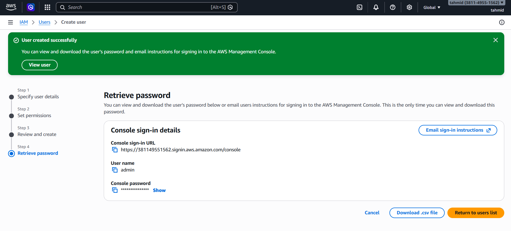

The `iam-admin` user in SecurityAccount with AdministratorAccess. This is the user that runs Terraform and assumes the audit role. Not using root for anything after initial setup.

---

### 2. MFA enabled on root
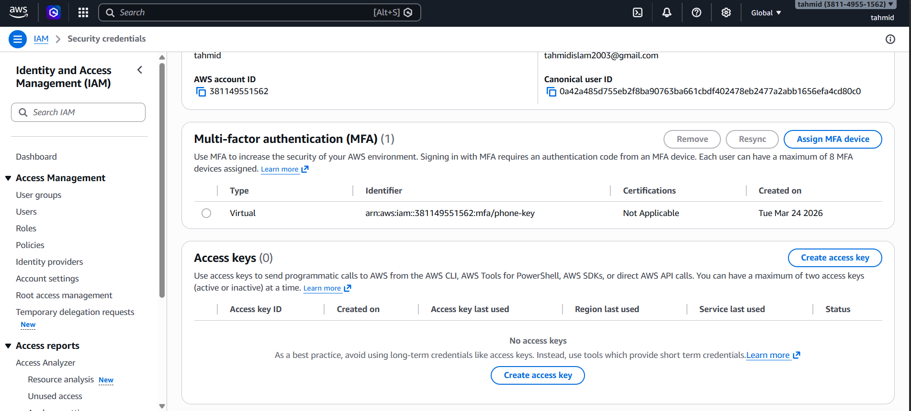

Root account MFA enabled before creating any IAM resources. Root account access is the highest-risk vector in AWS — MFA is the first thing to configure.

---

### 3. Billing alarm set
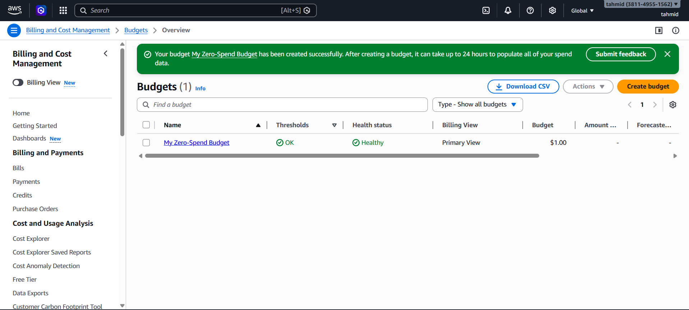

Billing alert configured to catch unexpected charges. Running Terraform in a lab account means you can accidentally leave resources running. A cost alarm is a safety net.

---

### 4. Both accounts in AWS Organizations
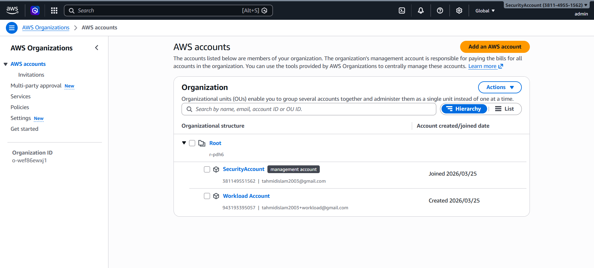

SecurityAccount (management) and WorkloadAccount (member) in the same Organization. The Organization structure is what allows Terraform to use `OrganizationAccountAccessRole` to bootstrap into the WorkloadAccount.

---

### 5. Access keys configured
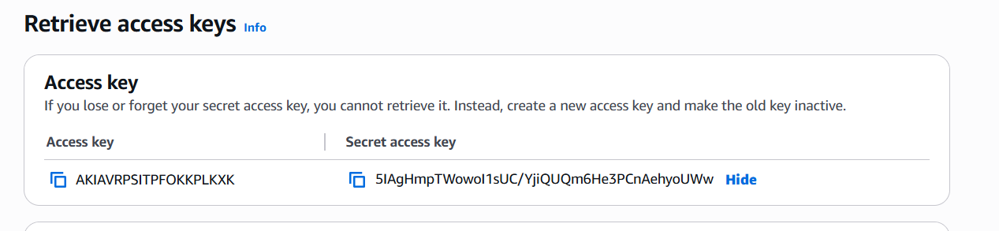

Access keys for the `iam-admin` user, configured as the `default` CLI profile. These are used by Terraform and the AWS CLI to authenticate from the SecurityAccount side.

---

### 6. SecurityAuditRole created
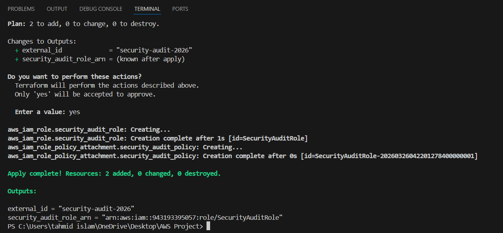

`SecurityAuditRole` visible in the WorkloadAccount IAM console after `terraform apply`. Terraform deployed this role using the `workload` provider alias, which authenticated via `OrganizationAccountAccessRole`.

---

### 7. Trust policy — ExternalId and MFA conditions
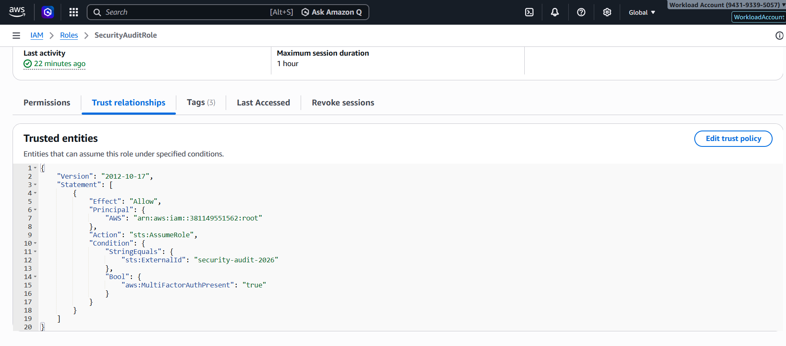

The trust policy on `SecurityAuditRole` as it appears in the console. Both conditions are visible: `sts:ExternalId` set to `security-audit-2026` and `aws:MultiFactorAuthPresent` set to `true`. Both must pass for the assume-role call to succeed.

---

### 8. SecurityAudit policy attached
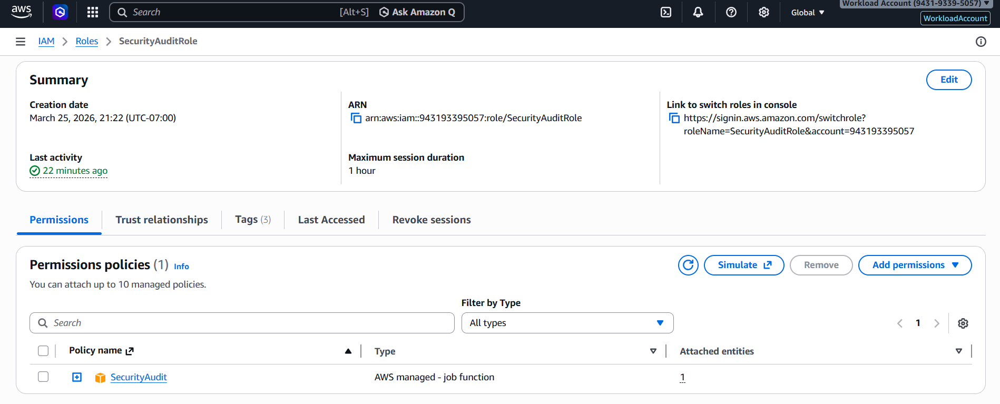

AWS-managed `SecurityAudit` policy attached to the role. This grants read-only access across AWS services. No inline policies, no customer-managed policies — using the AWS-managed policy keeps the permission set predictable and auditable.

---

### 9. Role assumption successful — temporary credentials returned
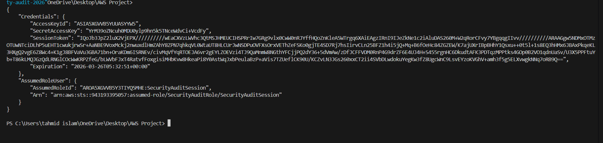

Output of the `aws sts assume-role` command. The response contains temporary `AccessKeyId`, `SecretAccessKey`, and `SessionToken` that expire after one hour. The ExternalId and MFA code were both required for this to succeed.

---

### 10. Assumed role identity confirmed
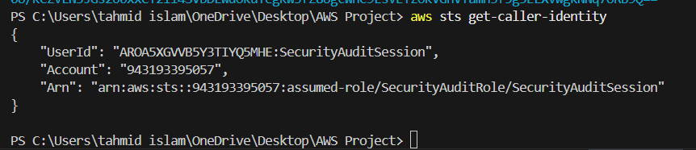

`aws sts get-caller-identity` run using the temporary credentials. The response shows the assumed role ARN and session name (`SecurityAuditSession`), confirming the credentials are scoped to the WorkloadAccount role rather than the SecurityAccount user.

---

### 11. Read-only access verified
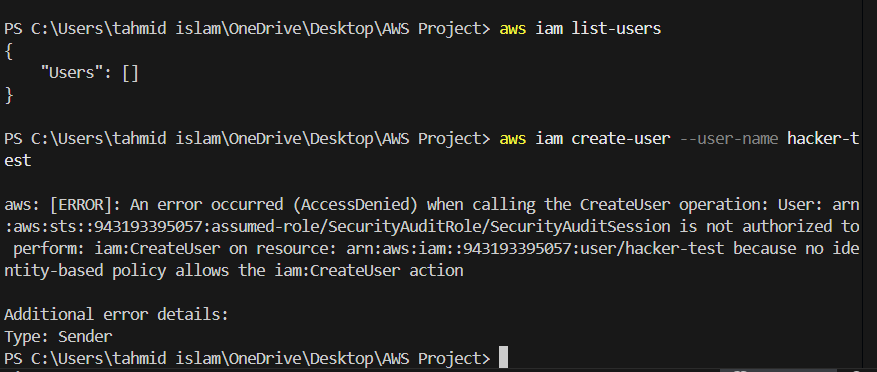

Two API calls using the assumed role credentials:
- `aws iam list-users` → returns user list (read permitted)
- `aws iam create-user` → AccessDenied (write blocked)

This confirms the SecurityAudit policy is working as expected and the role cannot be used to make changes in the WorkloadAccount.

---

## Skills demonstrated

- AWS Organizations and cross-account architecture
- IAM role trust policies and the assume-role flow
- Confused deputy attack and ExternalId mitigation
- MFA enforcement as an IAM condition
- Least privilege with AWS-managed policies
- Terraform multi-provider pattern for cross-account deployment
- STS temporary credentials and session scoping
- CLI-based role assumption and verification
